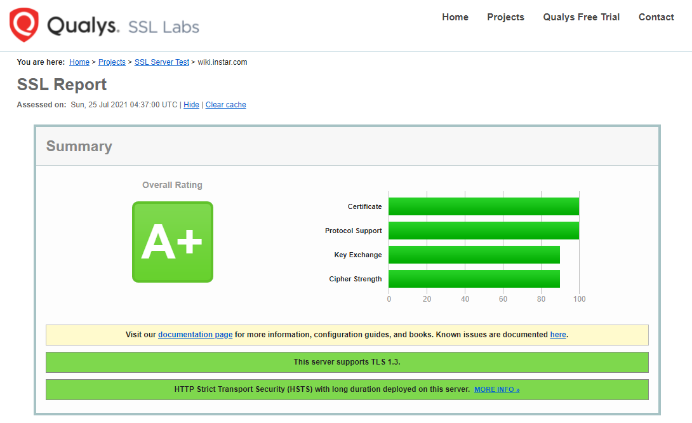

# Docker Ingress

## NGINX Proxy Setup

This is the NGINX configuration that you can use to direct web traffic into your Docker cluster:

[See User Guide for more information](https://mpolinowski.github.io/devnotes/2021-02-22-nginx-docker-ingress)

> Note that I am using `nginx:1.21.1-alpine` - I believe that you need at least version `1.18` or `1.19` to be able to use the __ssl_conf_command__ directive (check ssl/ss-params.conf). You can comment these two lines out to use the stable release of NGINX